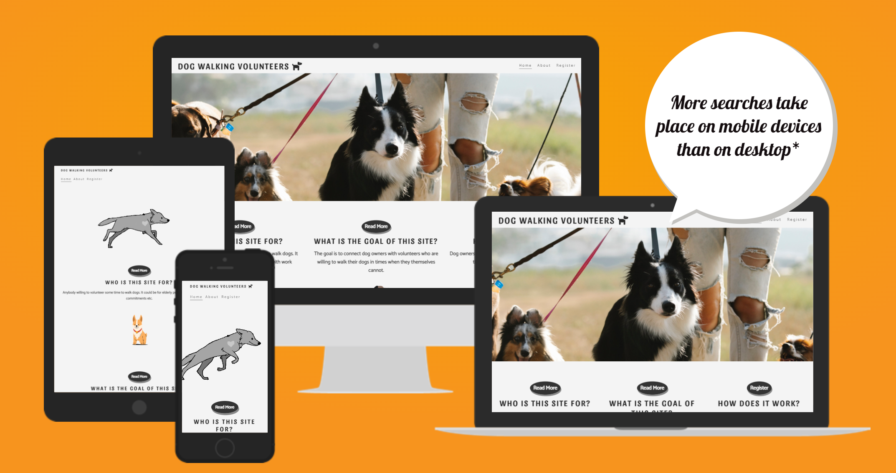
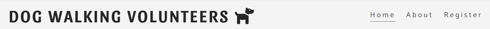
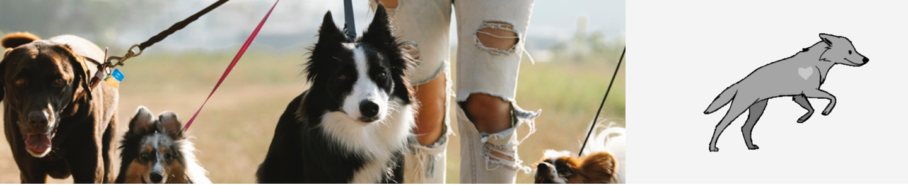
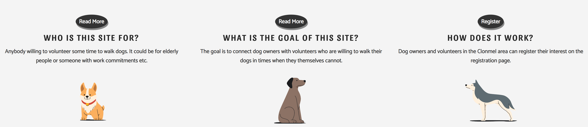
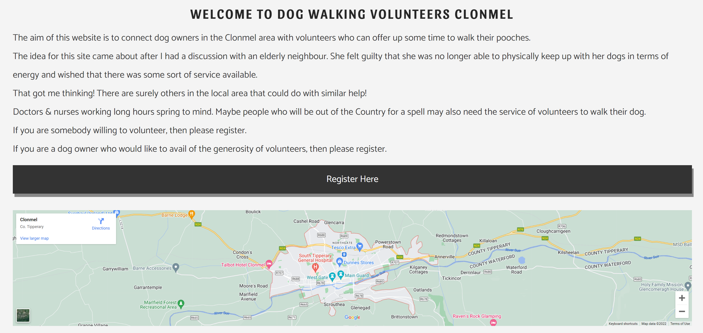
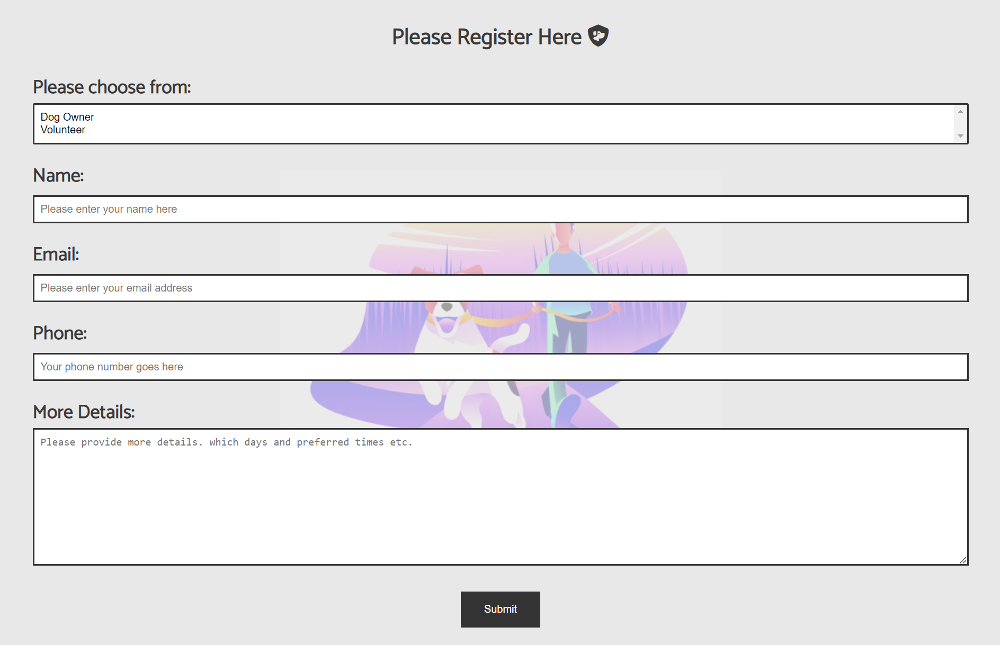
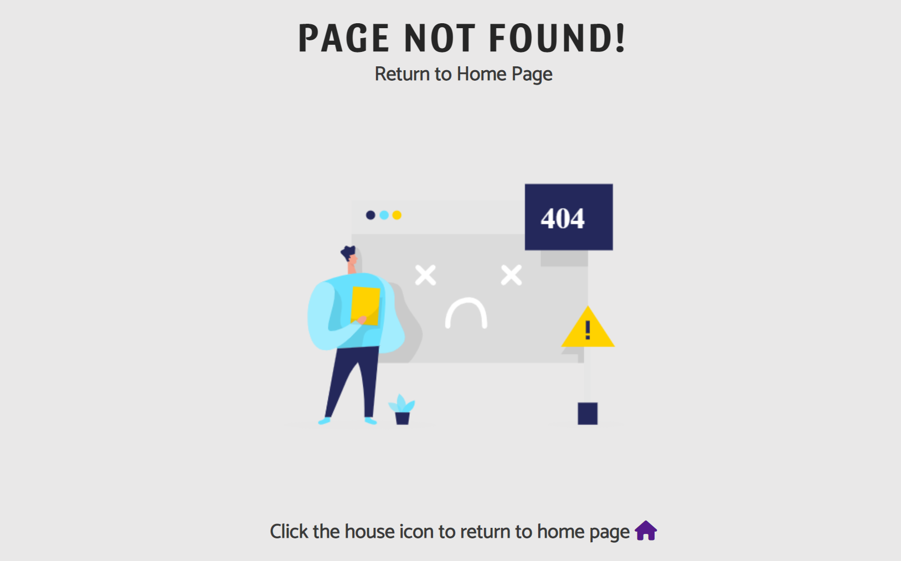
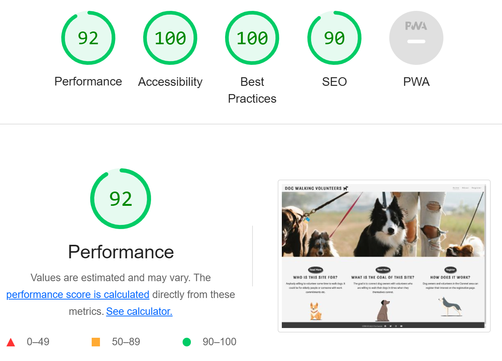

# Dog walking Volunteers

The dog walking volunteers website was created to connect Clonmel dog owners with people kind enough to offer up some time to help walk their dogs.
People who use this site can register as either a dog owner or a volunteer. We will then be able to connect people based on the details provided with the registration form.

The initial targeted audience for this project is elderly people who require a helping hand with dog walking. However, it is not limited just to the elderly. The goal of the project is to link dog owners with volunteers.

The purpose of the site is clearly outlined on the home page. Three side-by-side sections contain a sentence and a call-to action button encouraging users to explore more of the site.

[View the live project here](https://pajohack.github.io/Clonmel-dogwalking-volunteers/index.html)

Screenshot taken from amiresponsive.co.uk

 

## Features

----

- Navigation

   - The top left of each page displays the site logo. When clicked it navigates you back to the home page.
   - In the top right of each page are links to the three pages that make up the site. Home, About & Register. 
   - The logo and navigation are consistant across all pages of the site allowing for easy navigation without using the back button.
   - The font color contrasts nicely against the background color making it clear and easy to read.

 

 

- Home Page

   - The home page contains a hero image on high resolution screens and is replaced with an animated gif on mobile devices. The image shows a person walking dogs. This gives visitors a visual clue of what the site is all about.
   - Next, the user will see three divisions with a sentence in each giving a brief summary of the site.
   - This section also contains three call-to action buttons encouraging the user to either read more or register their interest.
   - The "Read More" button brings the user to the about page where more can be read about the purpose of the site and how the idea came about.
   - The "Register" button takes users straight to the register page. Here the user can register with the site as either a dog owner or volunteer.

 

- About Page

  - The about page contains a section explaining the goal of the site and who it is for.
  - There is a large call to action button which brings the user to the register page where they can complete the registration form.
  - Below the call-to action button is a map of the Clonmel area. Showing users the area where this service is based.

 

- Resgister Page

  - The register page contains the form used to sign up to the site. The form itself was kept plain and as simple as possible keeping elderly people in mind.
  - The form contains a dropdown to choose between dog owner or volunteer. This field is required. As there are only two options, I chose to show both options rather than hiding one. I think a dropdown fits the look and feel of the site better than radio buttons.
  - Next, the user enters their name in a text input, which is also a required field.
  - The email field is not an as required field. This is intentional as perhaps some older user may not have an email address.
  - The phone number field is a required field.
  - In the more details textarea, users can provide more details such as their preferred days and times. This field is also required.
  - The inputs and textarea are outlined with a bright border when the user clicks into the fields.
  - When the required info is provided and the submit button is clicked, the form data is submitted.

 

- 404 Page

  - This is the 404 page users will see if they enter an incorrect url.
  - Users can return to the home page by either clicking the home icon or by using the navigation links.

 

- Footer

  - The footer area is consistant on each page.
  - It contains a Copyright symbol and fontawesome icons which are also links to social media sites.
  - When clicked, the links open in a new tab which allows easy navigation and keeps this site open in the browser.

 

## Testing
----

- Functionality

| Test Label                             | Test Action                | Expected Outcome                                                    | Test Outcome  |
|----------------------------------------|----------------------------|---------------------------------------------------------------------|---------------|
| Logo navigation                        | Click logo                 | User taken to home page from anywhere on the site                   | PASS          |
| Navigation links                       | Click each nav link        | The user is navigated to the correct page from anywhere on the site | PASS          |
| Read More first button on home page    | Hover over button          | Background color changes to red                                     | PASS          |
| Read More first button on home page    | Click Read More Button     | Taken to the about page                                             | PASS          |
| Read More second button on home page   | Hover over button          | Background color changes to red                                     | PASS          |
| Read More second button on home page   | Click Read More Button     | Taken to the about page                                             | PASS          |
| Register button on home page           | Hover over button          | Background color changes to red                                     | PASS          |
| Register button on home page           | Click Register button      | Taken to the register page                                          | PASS          |
| Social media icons in footer            | Click each icon            | User taken to the expected social media platform                    | PASS          |
| Register here button on the about page | Hover over button          | Background color changes to red                                     | PASS          |
| Register here button on the about page | Click register here button | Navigated to the register page                                      | PASS          |
| Register form dropdown                 | Select an option           | User can select either Dog owner or volunteer                       | PASS          |
| Register form name text input          | Add text                   | User is able to type letters in this field                          | PASS          |
| Register form email input              | Enter email                | User is able to add an email address                                | PASS          |
| Register form phone text field         | Add text                   | User can add their phone number as text                             | PASS          |
| Register form more details textarea    | Add text                   | User can add multi line text here                                   | PASS          |
| Register form submit button            | Hover over button          | Background color changes to red                                     | PASS          |
| Register form submit button            | Click Submit Button          | Validate that all required fields are complete                                  | PASS          |
| Register form submit button            | Click Submit button        | form data is posted to "https://formdump.codeinstitute.net"         | PASS          |

 

- Browser Compatibility

  - The website was tested in different browsers and works well in each one.
  - Browsers used: Chrome, FireFox, Edge & Safari.

 

- Responsivness

  - I used Google Developer tools to check the responsiveness of the site on different screen sizes. The site responded well to very large screens such as iMac Pro, medium screens such as iPad Pro and very small screens such as iPhone SE.
  - On smaller screens the hero image is replaced with an animated gif.
  - Also on smaller screens the logo size is reduced and the navigation links are moved under the header.

 

- Validation

  - HTML. After using the W3C validator, no errors were found.
  - CSS. After using Jigsaw validator, no errors were present.
  - Accessibility. I confirmed that the site meets the required needs by using lighthouse to validate.

 

 

## Bugs
----

- Squashed Bugs

  - When I initially used the W3C HTML validator, it failed as I was using deprecated attributes on the iframe containing the map. Namely scrolling and frameborder. I removed these attributes and instead used rules in my css file. The validator was happy after doing this. 

 

- Unfixed Bugs
  - There are no unfixed bugs.

 

## Deployment
----

- The site was deployed via GitHub Pages. This is achieved through your GitHub repository by clicking on settings and selecting "Pages" in the code and automation section. Under the "Build and deployment" heading use deploy from a branch option. Then, under the "Branch" heading, select master branch. After a few moments a link to the live project is created and available to browse and share. 

- Any alterations made to the files can be pushed to GitHub with the "git push" command in the terminal. GitHub Pages picks up the changes and updates the live site after a moment or two.

- Users can download a copy of the files in this project to their local computer by cloning the repository. There are three ways of doing this, download a Zip, use SSH or using HTTPS.

- [View the live project here](https://pajohack.github.io/Clonmel-dogwalking-volunteers/index.html)

 

## Credits
----

- Content

  - The logo, hero image and navigation elements of the site were based on those that I learned about in the CI Love Running walkthrough project.
  - The idea for fontawesome social media icons in the footer came from the CI Love Running walkthrough project.
  - The idea for the map of Clonmel on the about page came from the CI Coders Coffeehouse walkthrough.

 

- Media

  - The hero image on the home page was taken from [Pexels](https://www.pexels.com/photo/unrecognizable-woman-walking-dogs-on-leashes-in-countryside-7210754/)
  - The dog illustrations on the home page were taken from [DrawKit](https://www.drawkit.com/product/animal-pets-illustrations)
  - The social media icons were taken from [Fontawesome](https://fontawesome.com/)

   

## Technologies & Tools Used
----

 

- HTML5
- CSS3
- Fontawesome
