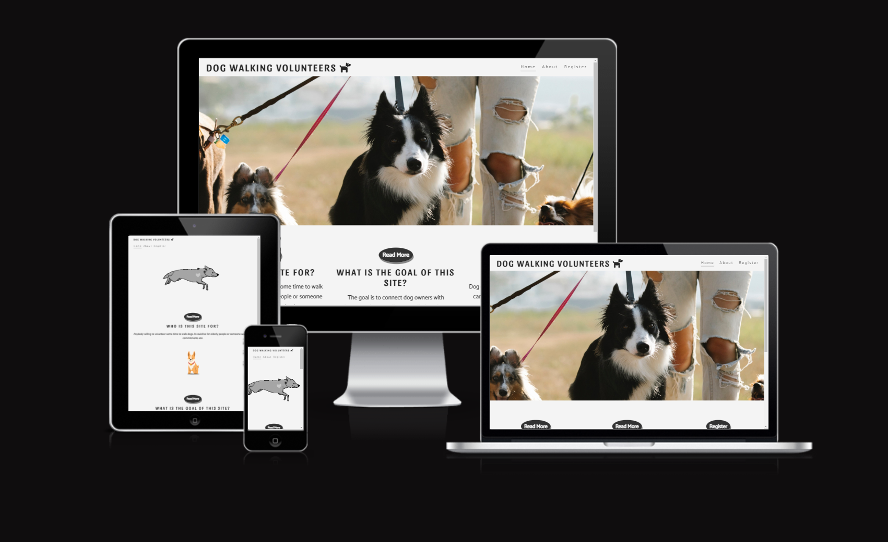
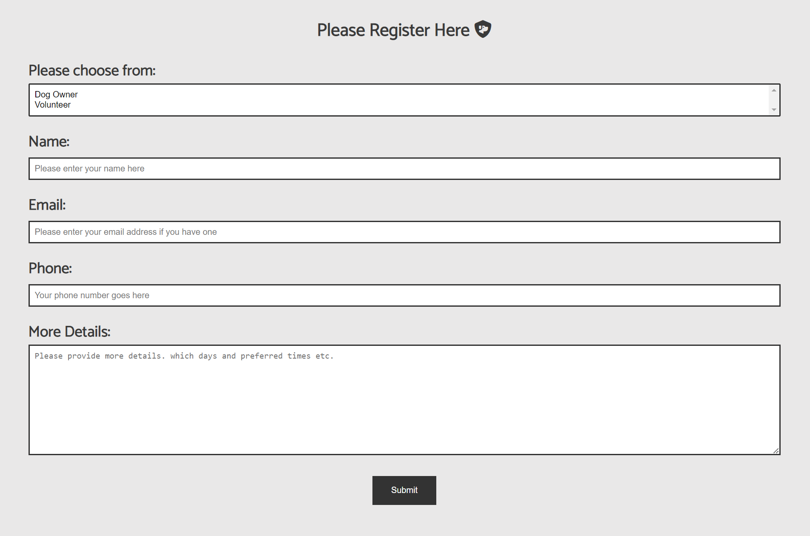

# Dog walking Volunteers

The dog walking volunteers website was created to connect Clonmel dog owners with people kind enough to offer up some time to help walk their dogs.
People who use this site can register as either a dog owner or a volunteer. We will then be able to connect people based on the details provided with the registration form.

[View the live project here](https://pajohack.github.io/Clonmel-dogwalking-volunteers/index.html)

## Features

----

- Navigation

   - The top left of each page displays the site logo. When clicked navigates you back to the home page.
   - In the top right of each page are links to the three pages that make up the site. Home, About & Register.
   - The logo and navigation are consistant across all pages of the site.
   - The font color contrasts nicely against the background color making it clear and easy to read.

----

- Home Page

   - The home page contains a hero image on high resolution screens and is replaced with an animated gif on mobile devices.
   - Next the user will see three divisions with a sentence each giving a brief summary of the site.
   - This section also contains three call to action buttons encouraging the user to either read more or register their interest.
   - The "Read More" button brings the user to the about page where more can be read about the purpose of the site and how the idea came about.
   - The "Register" button takes users to the register page. Here the user can register with the site as either a dog owner or volunteer.

----

- About Page

  - The about page contains a section explaining the goal of the site and who it is for.
  - There is a large call to action button which brings the user to the register page where they can complete the registration page.
  - Below the call to action button is a map of the Clonmel area.

----

- Resgister Page

  - The register page contains the form used to sign up to the site.
  - The form contains a dropdown to choose between dog owner or volunteer. This field is required.
  - Next the user enters their name in a text input which is also a required field.
  - The email field is not an as required field. This is intentional as perhaps some older user may not have an email address.
  - The phone number field is a required field.
  - In the more details textarea, users can provide more details such as their preferred dats and times.
  - When the required info is provided and the submit button is clicked, the form data is submitted.

  ----

- Footer

  - The same footer area is at the bottom of each page.
  - It contains a Copyright symbol and fontawesome icons which are also links to social media sites.
  - When clicked these links open in a new tab.

